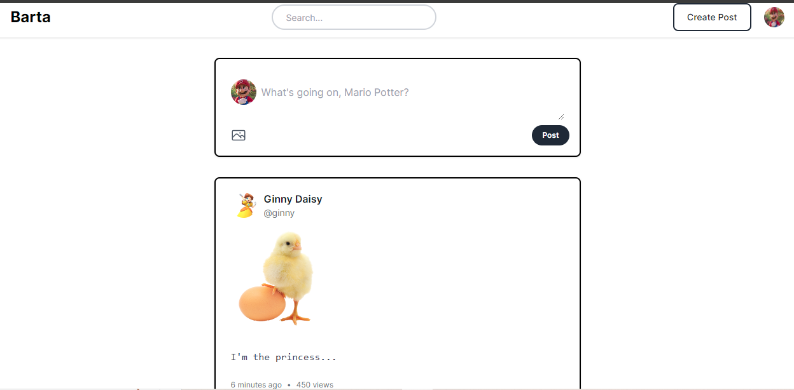
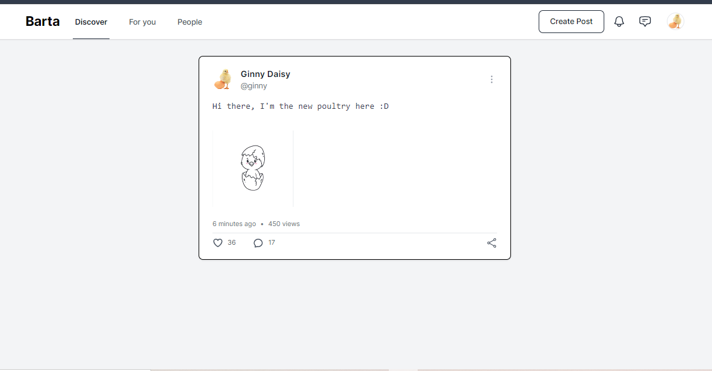
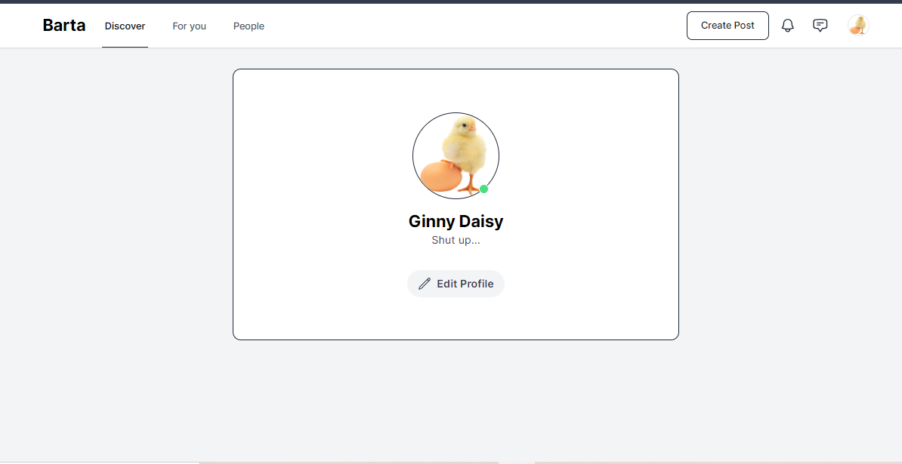
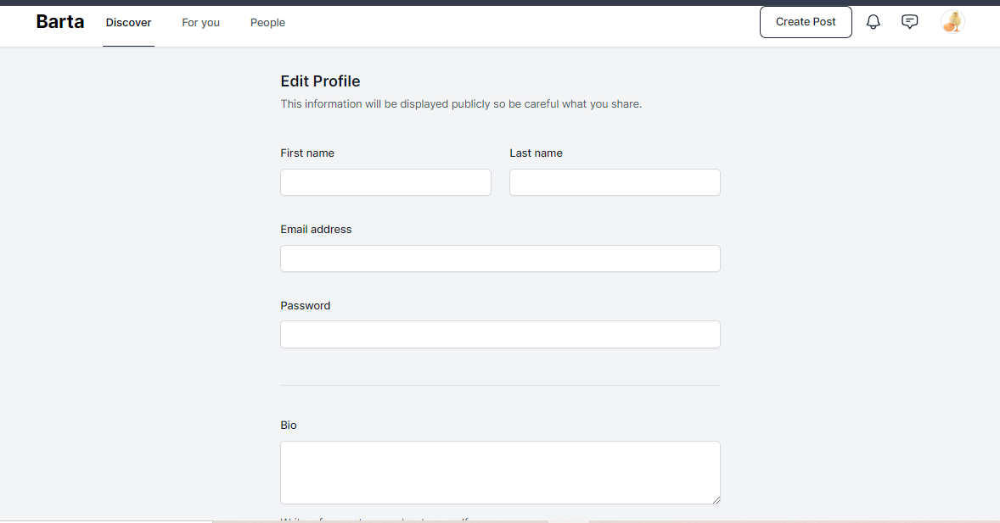

# Barta Web Application

Barta serves as a social networking platform aimed at fostering closer connections among individuals.

### UI Credit

UI Code:

```bash
https://github.com/alnahian2003/barta-template/tree/master
```

## Screenshots






## Features


### To Start

Clone the repository to your local machine:

```bash
git clone https://github.com/tetat/barta-web-app
```